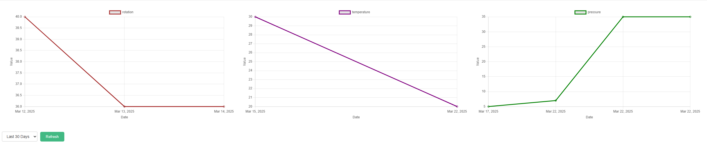

Тестовое задание для компании Конкорд. Выполнил Снятков Дмитрий Андреевич.

Как запустить:
1. Создать файд .env в корневой директории и скопировать туда содержимое .env.example.
2. docker compose up
3. Зайти на [localhost:8080](http://localhost:8080/) или другой указанный вами в .env APP_URL
   
Для собственного интереса и упрощения проверки добавил фронт на vue:

Добавление новых точек на граф на фронте к сожалению пришлось вырезать, так как браузер игнорирует тело get запроса.
